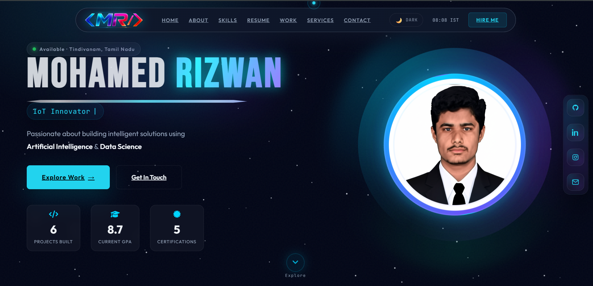
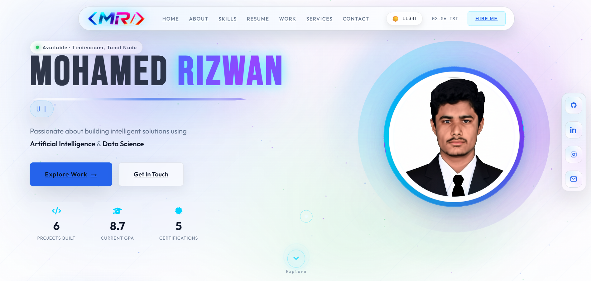

<h1 align="center">🌐 Personal Portfolio Website</h1>

<p align="center">
  A modern, futuristic portfolio website designed with immersive UI, smooth animations, and high-performance frontend experience.
</p>

<p align="center">
  <a href="https://mdrizwan27.pages.dev/">
    
  </a>
  
  
</p>

---

## 🖼️ Preview

<p align="center">
  <a href="https://mdrizwan27.pages.dev/">
    
    
  </a>
</p>

<p align="center">
  🌙 Dark Mode &nbsp;&nbsp;&nbsp; | &nbsp;&nbsp;&nbsp; ☀️ Light Mode
</p>

---

## ✨ Key Features

<table align=center>
<tr>
<td>

🚀 **Modern UI/UX**  
✨ Futuristic glassmorphism design  
✨ Clean typography & spacing  

</td>
<td>

🌙 **Theme System**  
🌗 Dark & Light mode toggle  
💾 Theme saved with local storage  

</td>
</tr>

<tr>
<td>

⚡ **Advanced Animations**  
🎯 Custom cursor interaction  
🎬 Smooth scroll-based effects  
⏳ Preloader with progress  

</td>
<td>

🌌 **Interactive Background**  
✨ Animated canvas particles  
🌠 Dynamic visual effects  

</td>
</tr>

<tr>
<td>

📱 **Fully Responsive**  
📲 Mobile, tablet & desktop ready  
📐 Fluid grid layout  

</td>
<td>

🎯 **Performance Optimized**  
⚡ Fast loading experience  
🚀 Lightweight & smooth  

</td>
</tr>
</table>

---

## 🧩 Sections Included

<p align="center">

<table align="center">
<tr>
<td align="center">🏠<br><b>Hero</b><br><sub>Animated intro</sub></td>
<td align="center">👨‍💻<br><b>About</b><br><sub>Profile overview</sub></td>
<td align="center">⚡<br><b>Skills</b><br><sub>Tech stack</sub></td>
</tr>

<tr>
<td align="center">📄<br><b>Resume</b><br><sub>Download CV</sub></td>
<td align="center">💼<br><b>Projects</b><br><sub>Work showcase</sub></td>
<td align="center">🛠️<br><b>Services</b><br><sub>What I offer</sub></td>
</tr>

<tr>
<td colspan="3" align="center">📬<br><b>Contact</b><br><sub>Get in touch</sub></td>
</tr>
</table>

</p>

---

## ⚙️ Tech Stack

<p align="center">
  
</p>

<p align="center">
  <b>HTML5</b> • Structure &nbsp;&nbsp; | &nbsp;&nbsp;
  <b>CSS3</b> • Styling & Animations &nbsp;&nbsp; | &nbsp;&nbsp;
  <b>JavaScript</b> • Interactivity
</p>

---


## 📂 Project Structure
```bash
📁 assets
 ┣ 📁 css
 ┣ 📁 js
 ┗ 📁 img
📄 index.html
📄 RESUME.pdf

---

## 🚀 Getting Started

### 1️⃣ Clone the repository
```bash
git clone https://github.com/mohamedrizwan4518/My-Portfolio.git

---
cd My-Portfolio

---
index.html

> ⚡ Built with performance, design & innovation in mind
